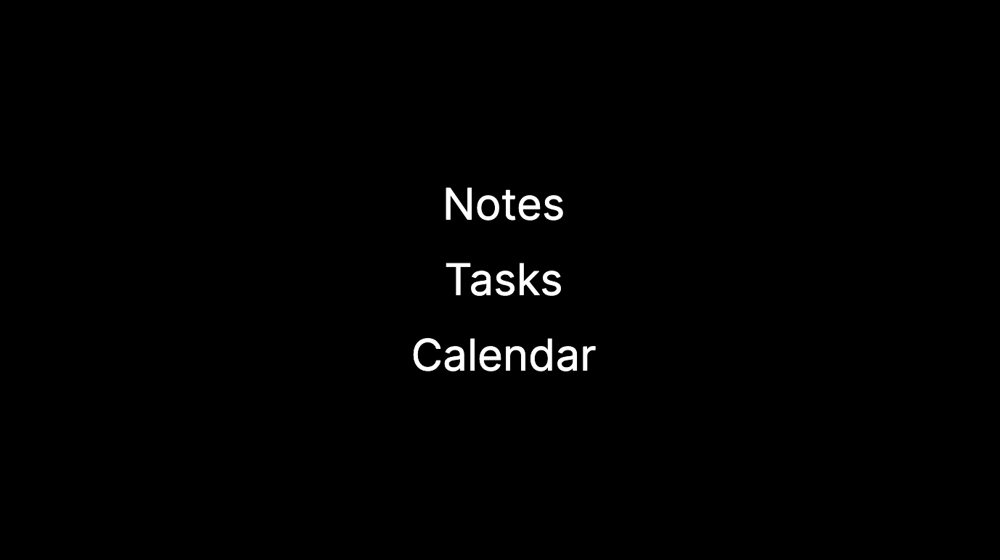

# Next JS App

## Table of Contents
- [Description](#description)
- [Usage](#usage)
- [Contributing](#contributing)
- [Questions](#questions)




## Description
This is a nextJS application that serves as a workday tool. The user is able to take notes and add tasks they must complete.

## Usage
First, run the development server:

```bash
npm run dev
# or
yarn dev
# or
pnpm dev
```

Open [http://localhost:3000](http://localhost:3000) with your browser to see the result.

You can start editing the page by modifying `app/page.tsx`. The page auto-updates as you edit the file.

This project uses [`next/font`](https://nextjs.org/docs/basic-features/font-optimization) to automatically optimize and load Inter, a custom Google Font.

## Deploy on Vercel

The easiest way to deploy your Next.js app is to use the [Vercel Platform](https://vercel.com/new?utm_medium=default-template&filter=next.js&utm_source=create-next-app&utm_campaign=create-next-app-readme) from the creators of Next.js.

Check out our [Next.js deployment documentation](https://nextjs.org/docs/deployment) for more details.

## Contributing
Steve Weede

## Questions
Please send questions to:
steveweede@yahoo.com or to BabyStu at Github